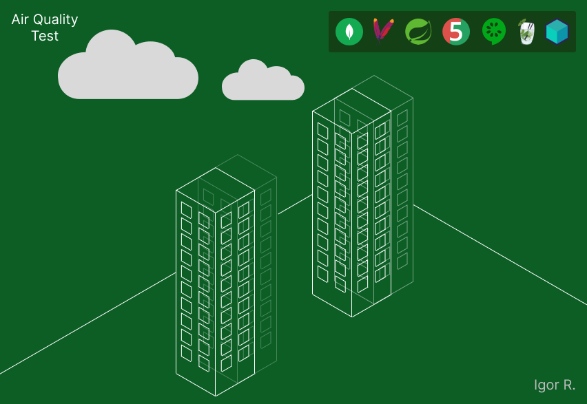

## Monitoramento da Qualidade do Ar com NoSQL e Testes

<p align="center">
  
</p>

---
### Introdução
  Este projeto implementa testes automatizados em uma aplicação existente, abrangendo testes de unidade, testes de integração e testes de aceitação.
A aplicação original consiste em uma API para controle da qualidade do ar.

---

### Ferramentas
* Apache Maven (empacotamento e gestão de dependências);
* Cucumber (framework para testes de aceitação guiados por comportamento - BDD);
* Java 21 (linguagem de programação orientada a objetos e tipada);
* JUnit 5 (framework para testes de unidade e integração em Java);
* Mockito (framework para criação de objetos mock em testes Java);
* MongoDB (banco de dados orientado a documentos);
* Spring (framework de desenvolvimento Java);
* Testcontainers (biblioteca para provisionar contêineres Docker para testes de integração).

---

### Execução de Testes com Maven e IntelliJ

Este projeto utiliza Maven para gerenciamento de dependências e execução de testes. As classes de teste são `CucumberIntegrationTest.java` e `MongoRepositoryTest.java`.
Ambas estão no diretório `/src/test/java/br.com.fiap.airquality/`.

**Execução dos Testes**

Os testes deste projeto foram executados de formas principais: utilizando o Maven diretamente e através da interface do IntelliJ IDEA.

#### 1. Execução com Maven

1.  **Abra o terminal ou prompt de comando:** navegue até o diretório raiz do seu projeto (onde o arquivo `pom.xml` está localizado).

2.  **Execute os testes:** utilize o seguinte comando Maven para executar todas as classes de teste:

    ```
    mvn test
    ```

    Este comando irá compilar o projeto, executar os testes definidos e gerar um relatório de resultados.

#### 2. Execução com IntelliJ IDEA

1.  **Abra o projeto no IntelliJ IDEA:** importe o diretório do seu projeto no IntelliJ IDEA (File > Open).

2.  **Navegue até as classes de teste:** localize as classes de teste `CucumberIntegrationTest.java` e `MongoRepositoryTest.java` na estrutura do projeto.

3.  **Execute uma classe de teste individual:**
    * Clique com o botão direito dentro da classe de teste.
    * Selecione a opção "Run NomeDaClasseDeTeste".

---

### Documentação Oficial

[Introduction | Cucumber](https://cucumber.io/docs)

[Gherkin | Cucumber](https://cucumber.io/docs/gherkin)

[Streamlining Java Application Development With MongoDB: A Comprehensive Guide to Using Testcontainers](http://mongodb.com/developer/languages/java/testcontainers-with-java-and-mongodb)
