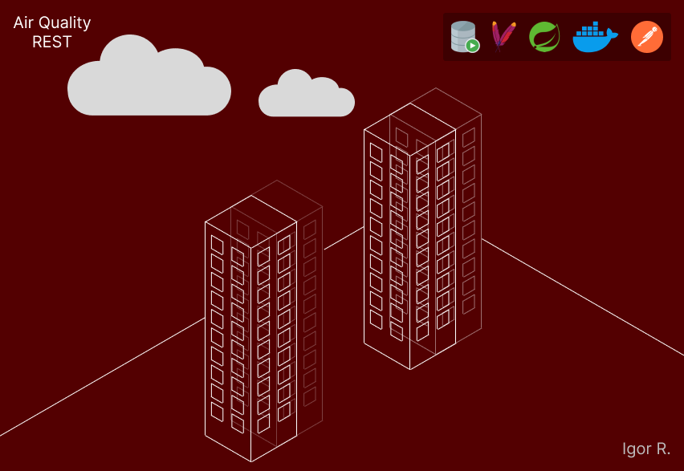

## API RESTful que Simula o Monitoramento da Qualidade do Ar

  

---

Este projeto dá prosseguimento a este repositório: [fiap-air-quality-plsql](https://github.com/igor-u/fiap-air-quality-plsql/tree/main).

Optei por separar as funcionalidades RESTful das funcionalidades de PL/SQL do primeiro projeto; é possível combinar as funcionalidades, ao executar
os scripts PL/SQL do primeiro projeto para criação das automatizações do banco de dados.

---

### Ferramentas
* Apache Maven (empacotamento e gestão de dependências);
* Docker (conteinerização);
* Java 21 (linguagem de programação orientada a objetos e tipada);
* Oracle Database 19c (banco de dados);
* Postman (testes de API);
* SQL Developer (ambiente de desenvolvimento integrado para acessar o banco de dados Oracle);
* Spring Boot (inicialização de aplicativos baseados em Spring).

---

### REST
Esta API alcança o nível 2 do [Modelo de Maturidade de Richardson](https://restfulapi.net/richardson-maturity-model).

---

### Banco de Dados
* Caso queira utilizar um banco de dados Oracle, é necessário alterar as propriedades <code color="red">url</code>, <code color="red">user</code> e <code color="red">password</code>
nos arquivos `/src/main/resources/META-INF/persistence.xml` e `/src/main/resources/application.properties`.
Essas propriedades estão configuradas para receberem valores de variáveis de ambiente. É possível tanto criar as variáveis de ambiente com os valores desejados, quanto alterar os valores das propriedades diretamente.

* Caso queira utilizar outro banco de dados, é necessário alterar:
1. Dependências de banco de dados no arquivo `pom.xml`;
2. Propriedade <code color="red">driver</code> no arquivo `/src/main/resources/META-INF/persistence.xml`.
3. URL do banco de dados nos arquivos `/src/main/resources/META-INF/persistence.xml` e `/src/main/resources/application.properties`;

---

### Construção
* Certifique-se de ter o Maven instalado;
* Acesse o diretório raiz do projeto;
* Para criar um arquivo executável .jar, execute o comando <code color="green">mvn install</code>.

---

### Conteinerização
* Certifique-se de ter o Docker instalado;
* Acesse o diretório raiz do projeto;
* Para construir uma imagem Docker do projeto, execute o comando <code color="green">docker build -t air-quality-rest:1.0.0 .</code>;
* Para executar um contêiner da imagem criada, execute o comando <code color="green">docker container run --name air-quality-container -d -p 8080:8080 air-quality-rest:1.0.0</code>.

---

### Funcionalidades
As funcionalidades - presentes no arquivo `Air_Quality.postman_collection.json` -, envolvem objetos dos tipos:
* Estações de Monitoramento;
* Dispositivos:
    - Sensores de Qualidade do Ar;
    - Detectores de Vazamento de Gás;
    - Instrumentos de Monitoramento de Ozônio.
* Logs de Monitoramento;
* Usuários.

---
