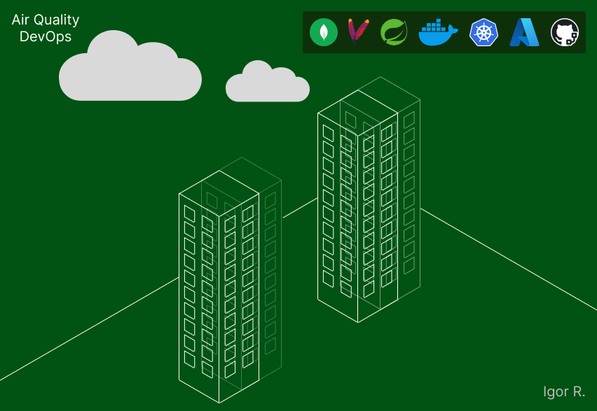

## Monitoramento da Qualidade do Ar com NoSQL e Práticas DevOps

<p align="center">
  
</p>

---
### Introdução
Este projeto implementa práticas da cultura DevOps em uma aplicação existente, abrangendo orquestração de contêineres, integração contínua e computação em nuvem.
A aplicação original consiste em uma API para controle da qualidade do ar.

---

### Ferramentas
* Apache Maven (empacotamento e gestão de dependências);
* Azure (plataforma de computação em nuvem da Microsoft);
* Docker (conteinerização);
* GitHub Actions (automação de workflows de desenvolvimento);
* Java 21 (linguagem de programação orientada a objetos e tipada);
* Kubernetes (orquestração de contêineres);
* MongoDB (banco de dados orientado a documentos);
* Spring (framework de desenvolvimento Java).

---

### Docker
* A imagem do backend foi construída através de um Dockerfile e enviada para o [Docker Hub](https://hub.docker.com/repository/docker/igorrrr/air-quality-rest);

* A imagem de banco de dados será `mongo:latest`.

Isso permite que essas imagens sejam facilmente acessíveis e utilizadas em diferentes ambientes, incluindo o cluster Kubernetes.

---

### Azure
A integração do GitHub Actions com o Azure Active Directory (recentemente renomeado para [Microsoft Entra ID](https://learn.microsoft.com/en-us/entra/fundamentals/new-name)) para automatizar a criação e gerenciamento do cluster Kubernetes envolve a configuração da autenticação e autorização seguras. O método utilizado é o OpenID Connect (OIDC), que permite que o GitHub Actions se autentique no Azure sem a necessidade de armazenar segredos de longa duração diretamente no repositório. Seguem os passos de configuração realizados no Azure:

---

1. Instalação da CLI do Azure para interagir com os serviços do Azure a partir da linha de comando:

```
  curl -sL https://aka.ms/InstallAzureCLIDeb | sudo bash
```
<p align="center">
  
</p>

---

2. Criação do Cluster Kubernetes (AKS):

```
  az aks create --resource-group air_quality --name air_quality_cluster --node-count 1 --generate-ssh-keys
```
<p align="center">
  
</p>

---

3. Criação de um novo [*App Registration*](https://learn.microsoft.com/en-us/entra/identity-platform/app-objects-and-service-principals?tabs=browser#application-registration) no Azure Active Directory:
```
  az ad app create --display-name "GitHubActionsOIDC"
```
O “appId” retornado é o ID do aplicativo.

---

4. Criação de uma [*Identity*](https://learn.microsoft.com/en-us/cli/azure/identity):
```
  az identity create --resource-group air_quality --name AirQ-Identity
```
<p align="center">
  
</p>

---

5. Criação de uma [*Identity Federated Credential*](https://learn.microsoft.com/en-us/cli/azure/identity/federated-credential):
```
  az identity federated-credential create --name AirQ-IFC --identity-name AirQ-Identity --resource-group air_quality --issuer   https://token.actions.githubusercontent.com --subject repo:igor-u/fiap-air-quality:branch:nosql
```

---

6. Criação de um [*Service Principal*](https://learn.microsoft.com/en-us/entra/identity-platform/app-objects-and-service-principals?tabs=browser#service-principal-object):
```
  az ad sp create --id {appId}
```
O “id” retornado é o ID do Service Principal. Um Service Principal (SP) é uma representação do App Registration no tenant do Azure
AD. Ele é necessário para atribuir permissões ao aplicativo. O comando cria o SP correspondente ao appId do registro de aplicativo criado anteriormente.

---

7. Atribuição da role “contributor” ao SP:
```
  az role assignment create --role contributor --subscription {subscriptionId} --assignee-object-id {spID} --assignee-principal-type ServicePrincipal --scope /subscriptions/{subscriptionId}/resourceGroups/air_quality
```
Isso permite que o GitHub Actions (representado pelo SP) execute ações como criar e
gerenciar recursos dentro do resource group “air_quality”, incluindo o cluster AKS.

---

*Tais comandos criam uma relação de confiança entre o Azure Active Directory (Microsoft Entra ID) e o GitHub Actions.*

---

### Kubernetes
Para a orquestração dos contêineres, são criados arquivos de configuração para o Kubernetes. Esses arquivos descrevem o estado desejado dos componentes dentro do
cluster. Os arquivos de configuração incluem:

* Deployments : definem como as instâncias (pods) do backend e do banco de dados devem ser criadas e gerenciadas. Garantem a disponibilidade e escalabilidade da API.

* Services: expõem o backend e o banco de dados como serviços de rede dentro do cluster Kubernetes, permitindo que outras aplicações ou usuários externos os acessem.

* NetworkPolicy: embora não seja estritamente necessário para este caso, um arquivo de Network Policy é definido para reforçar a segurança da rede dentro do cluster. Essa política especifica que apenas os pods do backend têm permissão para acessar os pods do banco de dados, isolando o tráfego de rede e melhorando a segurança.

---

### GitHub Actions
A automação do processo de implantação é gerenciada através do GitHub Actions. Um workflow de integração contínua (CI) é configurado para automatizar a implantação da aplicação.

O workflow criado executa as seguintes etapas principais:

[azure/login@v2](https://github.com/marketplace/actions/azure-login): o workflow primeiramente realiza um login na plataforma Microsoft Azure, utilizando credenciais configuradas como secrets no repositório do GitHub.

[actions/checkout@v4](https://github.com/marketplace/actions/checkout): copia o código do repositório do GitHub para o sistema de arquivos do runner, permitindo que as etapas subsequentes do workflow possam acessar e trabalhar com o código do projeto.

[azure/cli@v2](https://github.com/marketplace/actions/azure-cli-action): um script (deploy_to_azure_aks.sh) é executado para provisionar um novo cluster Kubernetes no Azure Kubernetes Service (AKS), e para executar o comando kubectl apply, aplicando os arquivos manifest do Kubernetes (Deployments, Services e NetworkPolicy) ao cluster recém-criado. Isso cria os pods do backend e do banco de dados, expõe os serviços e aplica as políticas de rede definidas.

---

[Conferir Workflow deste projeto no GitHub Actions](https://github.com/igor-u/fiap-air-quality/actions)

---

### Documentação Oficial
[Azure Command-Line Interface (CLI) documentation](https://learn.microsoft.com/en-us/cli/azure)

[Use the Azure Login action with OpenID Connect](https://learn.microsoft.com/en-us/azure/developer/github/connect-from-azure-openid-connect)

[UUID as Entity ID in MongoDB](https://www.baeldung.com/java-mongodb-uuid)
